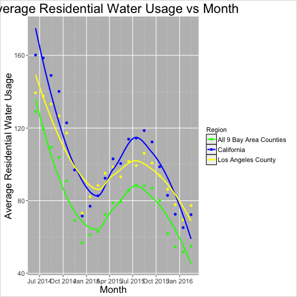
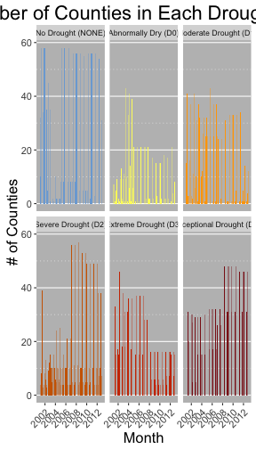

## CA Drought Data


--- &twocol

### Two column example

*** =left
Tiffany

```
## Warning: Removed 58 rows containing non-finite values (stat_count).
```



*** =right
Hope

```
## Error in eval(expr, envir, enclos): object 'binscounties' not found
```

*** =fullwidth


```
## Error: Faceting variables must have at least one value
```



## Slide with Bullets

- Bullet 1
- Bullet 2
- Bullet 3

## Slide with R Code and Output


```r
summary(cars)
```

```
##      speed           dist       
##  Min.   : 4.0   Min.   :  2.00  
##  1st Qu.:12.0   1st Qu.: 26.00  
##  Median :15.0   Median : 36.00  
##  Mean   :15.4   Mean   : 42.98  
##  3rd Qu.:19.0   3rd Qu.: 56.00  
##  Max.   :25.0   Max.   :120.00
```

## Slide with Plot


