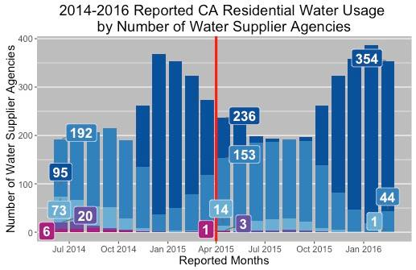

---

**How have CA drought conditions changed since the drought started in 2011?**

--- &twocol

**How has residential water usage changed since the enactment of the statewide mandatory
reductions in April 2015?**

*** =left width:70%

<table style="text-align:center"><tr><td colspan="2" style="border-bottom: 1px solid black"></td></tr><tr><td style="text-align:left"></td><td><em>Dependent variable:</em></td></tr>
<tr><td></td><td colspan="1" style="border-bottom: 1px solid black"></td></tr>
<tr><td style="text-align:left"></td><td>Residential Water Usage (R-GPCD)</td></tr>
<tr><td colspan="2" style="border-bottom: 1px solid black"></td></tr><tr><td style="text-align:left">policy_enacted</td><td>-19.982***</td></tr>
<tr><td style="text-align:left"></td><td>(0.680)</td></tr>
<tr><td style="text-align:left"></td><td></td></tr>
<tr><td colspan="2" style="border-bottom: 1px solid black"></td></tr><tr><td style="text-align:left">Observations</td><td>8,533</td></tr>
<tr><td style="text-align:left">R2</td><td>0.772</td></tr>
<tr><td style="text-align:left">Adjusted R2</td><td>0.760</td></tr>
<tr><td style="text-align:left">Residual Std. Error</td><td>29.060 (df = 8111)</td></tr>
<tr><td colspan="2" style="border-bottom: 1px solid black"></td></tr><tr><td style="text-align:left"><em>Note:</em></td><td style="text-align:right">*p<0.1; **p<0.05; ***p<0.01</td></tr>
</table>

***=right width:30%

--- &twocol

*** =left width:60%

**Have penalties on urban water suppliers affected residential water usage?**

*** =right width:40%

**Since June 2015, have urban water suppliers been meeting their required conservation standards?**

