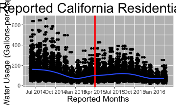
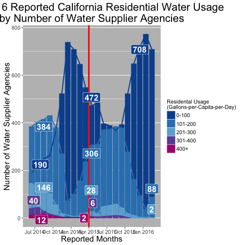

--- &twocol

## CA Drought Data

*** =left

*** =right

*** =fullwidth
---

--- &twocol

## Second slide

*** =left

<table style="text-align:center"><tr><td colspan="2" style="border-bottom: 1px solid black"></td></tr><tr><td style="text-align:left"></td><td><em>Dependent variable:</em></td></tr>
<tr><td></td><td colspan="1" style="border-bottom: 1px solid black"></td></tr>
<tr><td style="text-align:left"></td><td>Residential Water Use (R-GPCD)</td></tr>
<tr><td colspan="2" style="border-bottom: 1px solid black"></td></tr><tr><td style="text-align:left">policy_enacted</td><td>-19.982***</td></tr>
<tr><td style="text-align:left"></td><td>(0.475)</td></tr>
<tr><td style="text-align:left"></td><td></td></tr>
<tr><td colspan="2" style="border-bottom: 1px solid black"></td></tr><tr><td style="text-align:left">Observations</td><td>17,066</td></tr>
<tr><td style="text-align:left">R2</td><td>0.772</td></tr>
<tr><td style="text-align:left">Adjusted R2</td><td>0.766</td></tr>
<tr><td style="text-align:left">Residual Std. Error</td><td>28.689 (df = 16644)</td></tr>
<tr><td colspan="2" style="border-bottom: 1px solid black"></td></tr><tr><td style="text-align:left"><em>Note:</em></td><td style="text-align:right">*p<0.1; **p<0.05; ***p<0.01</td></tr>
</table>

***=right

---

